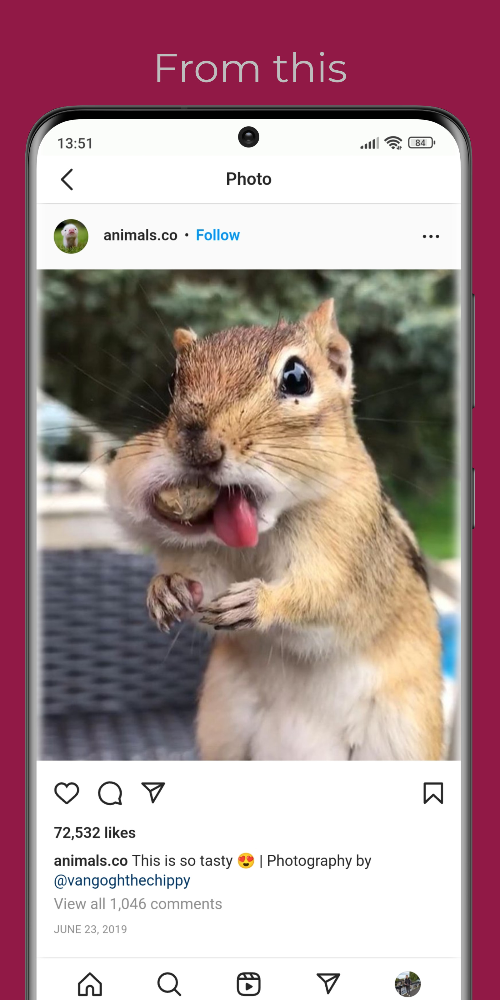
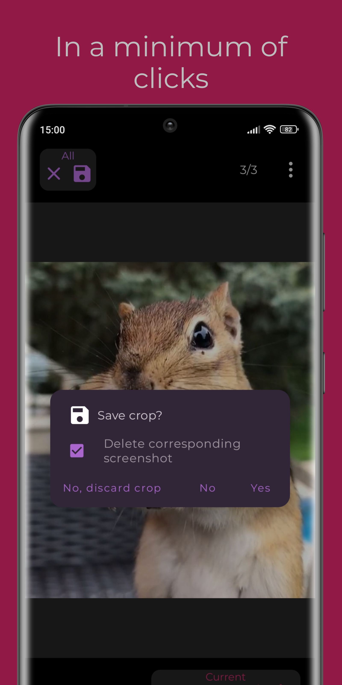
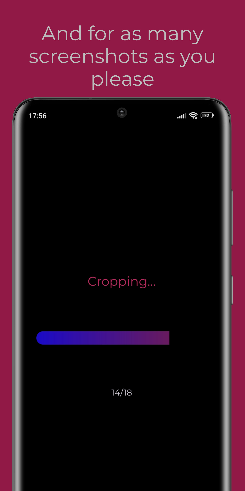

  

<h1 align="center">AutoCrop</h1>

  
  
  

   

  
  
  

------

<b> Android application for automatic batch cropping of phone screenshots.</b>

------

<h2 align="center">Download</h2>

<h2 align="center">Screenshots</h2>

|        |      |      |
|------------------------------------------------------------------------------|----------------------------------------------------------------------------|----------------------------------------------------------------------------|
|        |      |      |
|                                                                              |      |                                                                            |

<h2 align="center">Donations</h2>
 

<h2 align="center">License</h2>

<a href="https://github.com/w2sv/AutoCrop/blob/main/LICENSE">GPL-3.0 License</a> © <a href="https://github.com/w2sv">w2sv</a> [2022 - Present]

